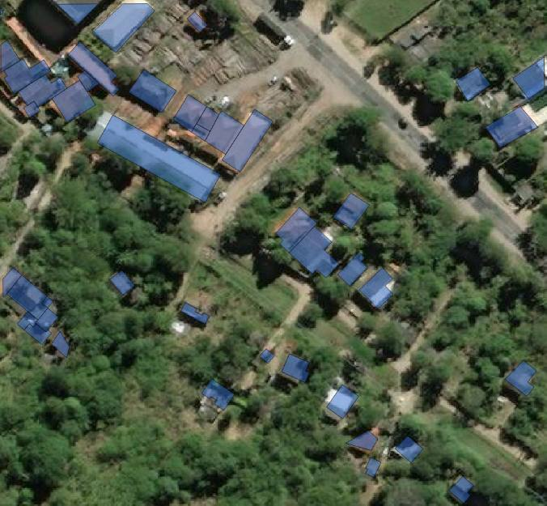

# Rural Settlement Detection
This code employs Deep learning(Convolutional Neural Network, CNN) , YOLO(You Only Look Once) and DBSCAN to perform settlement detection.

The training is performed using satellite image to map out and predict remote/rural communities in large regions for the purpose of expanding the reportedly effective Community Health Worker programme in a low cost, scalable and timely manner; ultimately increasing healthcare access to the under-served regions by reducing the effect of healthcare workforce shortage and also removing the barriers of transportation to the farther or non-existent healthcare centre; thereby reducing the gap between equitable health status between people in rural and urban settlements.

The prediction of the images are achieved using two dataset: SpaceNet dataset  and additional dataset derived  images from DigitalGlobe satellite using Microsoft Bing API. The satellite images are from Nigeria, CAR, Sierra-Leone, Guatemela,Gambia and Lesotho with  dimension of 1km by 1km tiles.

The figure below shows a sample satellite image from the Spacenet Dataset

The training images are satellite images currated from Microsoft Bing API and are not included in this repository because of the storage overhead. 

# installation requirement

This program has the following python dependencies.

* tensorflow
* keras
* open-cv  and 
* numpy

Once the dependencies has been installed, the program can be initiated by running the cnn.py  file in the root directory.
